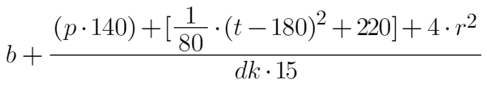

# Nuova idea

## Gioco (interazione con l'utente)
### Dinamiche
- Gioco a due
  - Due player e nemici in comune            ✔️ _GRAFICA FATTA_
- Generazione endless dei nemici             ✔️ _(INVECE DI MORIRE, IL NEMICO SI TELETRASPORTA PIU' INDIENTRO)_
- Griglia sullo sfondo per simboleggiare lo stato del vincitore. Più quadratini colorati della propria parte significa un punteggio maggiore.
  Ogni quadratino vale tipo 800 punti. Vince chi li conquista tutti.    ✏️ _IMPLEMENTATA GENERAZIONE INIZIALE, DA DISCUTERE COME FARE PER LA CONQUISTA_
- Se i nemici arrivano troppo vicino al player, egli perde.     ✔️

### Meccaniche
- Power-up per intralciare l'avversario o favorire se stessi      | Arrivano dall'alto come i cubi di Mario Kart    ✔️ _GRAFICA E COLLEGAMENTO A FUNZIONE FATTO_
  - Accecamento termporaneo
  - Moltiplicare x2
  - Rallentamento del rateo di fuoco del nemico
  - Scudo anti nemici/player
- Se un player invade la parte altrui, prende un tot di danno in un tempo t;    ✔️
- Un player può stunnare l'altro avvicinandosi molto e premendo un tasto . Se però lo colpisce, perde una marea di punti (per bilanciare).
  Con stunnare si intende impossibilità di sparare. Per difendersi l'altro player, in un lasso molto limitato di tempo deve premere un bottone, e così facendo sfugge
  dalle grinfie del bastardo [perry]
- Boost periodico per giocatore: aumenta di tanto velocità
  
**Tempo stimato di lavoro**: 16 gg
<br><br>
## Calcolo punteggio per Leaderboard
Il punteggio viene calcolato solo per il vincitore della partita

<br>**Il link al grafico è** [**qui**](https://www.desmos.com/calculator/evwekbh6lv)
<br>**Il bouns (b) vale 250**

Legenda:
 - dk : Delta tra rapporto kill/sparo dei due giocatori (perdente - vincitore)
 - t  : Durata della partita in secondi
 - p  : Numero di perry eseguiti
 - rt : Rapporto tra tempo e numero di colpi ricevuti dai nemici (solo del vincitore)
 - b  : Bonus in caso di come back, tipo per meno del 30% della partità è stato perdente

---------------
## Algoritmi
### Calcolo delle dimensioni dei quadrati dello score
In base alla risoluzione del monitor viene calcolato quanti quadratini dello score possono essere inseriti nello schermo in modo tale che le misure siano interi.
<br>E' valido sia per altezza che larghezza.
<br>Lo script è in Python3 per comodità.
```python3
MIN_DIM = 150       # Dimensione minima dei quadratini

while True:
  r = int(input(">>> "));
  l = []
  
  if r % 2 == 0:
    l.append (2)
  if r % 3 == 0:
    l.append (3)
  if r % 7 == 0:
    l.append (7)
  if not l:
    print ("Questo numero è una merda")
  
  d = 1
  c = 1
  a = False
  
  for d in l:
    a = True
    c = 1
    v = r
    while (v > MIN_DIM and d != 1):
      c += d    # qui c'è un bug. La c non è affidabile
      v /= d
    if v.is_integer ():
      print (d, '|', c, v, f"{v/96*2.54}cm")  # divisore, num_quad, dim_quad pixel, dim_quad cm
  
  if not a:
    print (d, c, v)
```
---------------

## Quesiti / Problemi da risolvere
 *Nessuno*
